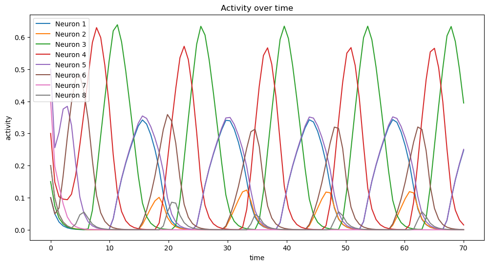

## Dynamics of Combinatorial Threshold-Linear Networks (CTLNs)

This project investigates the dynamics of Combinatorial Threshold-Linear Networks (CTLNs) which are a subclass of threshold-linear networks (TLNs). CTLNs consist of simplified neuron models where activation is governed by linear dynamics. Despite their simplicity, these networks exhibit rich emergent behavior such as limit cycles, chaotic behaviour etc, all driven by the structure of the directed graph that defines the network's connectivity. A system of ordinary differential equations (ODEs) will be used to model the dynamics of the network. Through the use of the odeint function of the scipy module in Python, the ODEs can be solved. The solved solution can then be visualised. It will also be investigated how varying initial conditions and parameters impact dynamic behaviour. This project will observe the dynamics of a two different 3-neuron CTLN networks and an 8-neuron CTLN network

Tasks completed:

* Created multiple CTLN networks with varying sizes
* Simulated network dynamics from various initial conditions and parameter values
* Visualized results using time-series plots of neuronal activity.

